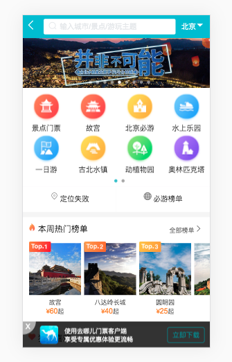
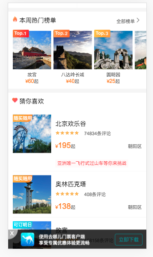
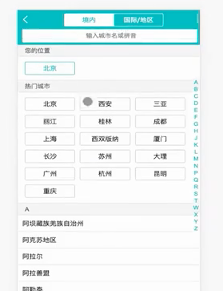
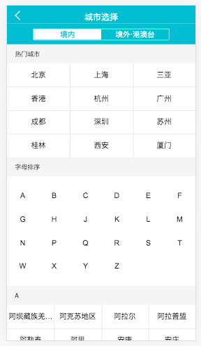

[TOC]

# quna

> A Vue.js project----去哪儿之景点页面

## Build Setup

``` bash
# install dependencies
npm install

# serve with hot reload at localhost:8080
npm run dev

# build for production with minification
npm run build

# build for production and view the bundle analyzer report
npm run build --report
```

## 开发前的准备

0.找cdn

+ https://www.jsdelivr.com/
+ [https://www.bootcdn.cn](https://www.bootcdn.cn/)

1.开发前的准备

①设置html字体

```css
html{font-size:50px;}
```

这样就可以直接将2倍图的数据/100得到rem的值，相当于分母为7.5

②尽量用flex进行布局

③使用stylus进行开发

安装stylus和stylus-loader(开发依赖)

```
npm install stylus stylus-loader --save-dev
```

④在styles文件夹中放入

- reset.css———样式重置
- border.css———移动端1px边框问题
- variable.styl———保存stylus中的变量

⑤在build/webpack.config.js中设置别名

```javascript
// resolve:解析
resolve: {
    extensions: ['.js', '.vue', '.json'],
    alias: {
      'vue$': 'vue/dist/vue.esm.js',
      '@': resolve('src'),
      'styles': resolve('src/assets/styles')
    }
 },
```

⑥移动端300ms点击延迟问题：某些机型、某些浏览器上，click事件会延迟300ms执行，体验不好

解决：库fastclick

```
npm install fastclick --save
```

```javascript
import FastClick from 'fastclick'
// 使用
FastClick.attach(document.body);
```

⑦在style中引入其他的css/sass/styl文件

```css
@import "~@/...."
```

第一个@：在css中使用import前面要加@

~ ：表示这是一个别名的路径

@ ：src的别名

⑧修改了webpack的配置项，或是安装了新的插件/库，都要重启服务器


## 首页

效果图：





遇到的问题：

1.三栏布局

(1)左右定宽，中间宽度自适应的三栏布局

左float:left

右float:right

中间

```css
.div{
  position:abosulute
  top:0;
	bottom:0;
	left:.7rem
	right:1.4rem
	margin:auto 0
  /* 垂直居中 */
}
```

(2)三栏自适应的布局

```css
.parent{
	display:flex;
}
.middle{
  flex-grow: 1;
}
```

2.vue-awesome-swiper版本不同，选项对象不同

3.移动端图片占位问题

如果组件中的图片没有加载出来，此时img的高度为0，下面的DOM就会顶上来，组件中的图片加载出来后，又将DOM撑下去，这样会造成页面的抖动

解决：在外面增加一个div

```css
div{
	  width:100%;   // 图片的宽度
    height:0;
  	overflow:hidden;
  	padding-bottom:30%; //图片高宽比
}
```

等价于：

```
div{
		width:100%;
		heigt:30.vw;
}
```

这种写法有兼容性问题

问题：需要给每个组件和图片都占位吗？

4.category页面布局+css样式

这是一个好的布局方案

```html
<div class="icons">
   <div class="icon">
     <!-- 给img嵌套一层div方便布局 -->
      <div class="icon-img">
         
      </div>
   		<div class="keywords">故宫</div>
   </div>
</div>
```

```css
.icons{
	height:0;
	width:100%;
	padding-bottom:50%;
	over-flow:hidden;
}
.icon{
	width:25%;
	height:0;
	padding-bottom:25%
	float:left;
	over-flow:hidden;
}
.icon-img{
  position absolute
  top 0
  left 0
  right 0
  bottom 0.44rem
  background: #ccc
}
.icon-img-container{
	height:100%
}
```

icons占位

icon占位

icon-img：由定位决定了它的宽度为父元素的宽度，高度为父元素的高度-0.44rem

Icon-img-container的高度100%是针对父元素的高度，父元素的高度小于宽度，所以icon-img的高度由父元素决定，宽度由内容撑开

## 城市选择页面

旧版：



新版：

